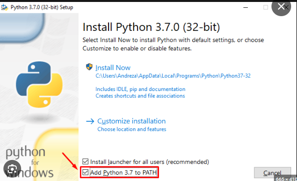

*** Depedências ***
- Selenium versão mais atual, no caso desse repositório está na versão 4.9
- Webdrive(chromedrive) versão dependendo da versão do seu chrome
- Python 3.4 ou superior
- IDE (vscode)
- Esse tutorial e para o sistema  windows11! mais serve para qualquer versão do windows
 
*** Modo de instalação do Python ***
1 - Primeiro iremos baixar  Python link: https://www.python.org/
2 - iremos instalar o python: Após baixar o python dê um duplo click e uma tela semelhante a imagem irá aparecer! como é mostrado na imagem chamanda . Marque a caixa de PATH do python e aperte e continuar ou proximo até finalizar a instalação.
3 - Após a instalação do Python Verifique se a instalação foi realizado com sucesso, e verifica se o PIP do python foi instalado
4 - Para ver as versões  do python e do pip faça os seguintes passos:
    4.1 - python --version
    4.2 - pip --version
    Se você seguiu corretamente os passos acima deve aparecer uma versão parecida como essa:
    4.3 versão do Python 3.11.4
    4.3 versão do pip 23.1.2

*** Modo de instalação do Robot Framework com pip do python ***
1 - Abra o terminal ou prompt de comando no seu sistema operacional.

2 - Instale o Robot Framework executando o seguinte comando:
    *** 2.1 - pip install robotframework ***

3 - Instale a biblioteca do Selenium para Robot Framework:
    *** 3.1 - pip install robotframework-seleniumlibrary ***

4 - Verifique se a instalação foi bem-sucedida usando o seguinte comando:
    *** 4.1 - robot --version ***

*** Instalando o chromeWebDrive ***

1 - Acesse esse site https://chromedriver.chromium.org/downloads 
2 - Escolha a versão que vai ultilizar de acordo com a versão do seu google chrome, como a imagem mostra 
3 - Baixa a o arquivo em formato .ZIP de acordo com seu sistema operacional como a imagem mostra 
4 - Após fazer o Download desconpact o arquivo.zip, porque vamos precisar dele mais a frente. A imagem mostra de como vai ficar o arquivo desconpactado!
5 - Copie o o arquivo chromeDrive.exe
6 Agora precisamos ir na pasta PATH onde está instalado o python. Geralmente ele está em um diretório parecido com esse: ( C:\Users\mb_la\AppData\Local\Programs\Python\Python311\Scripts\ ). Só mudem o nome de usuário para o usuário de vcs, na imagem vai mostrar mais ou menos de como vai ficar depois que você colar o arquivo do chromeDraive descompactado

*** Como automatizar o 'Formulário de prática' com o Selenium WebDriver ***

Este é um formulário da web de demonstração que contém todos os elementos de formulário que estão mais presentes em qualquer página da web. Portanto, ao automatizar este formulário, você aprenderia todos os comandos do WebDriver necessários para automatizar uma página da web. Este formulário contém os seguintes elementos:

caixas de texto
Botões do rádio
Caixas de seleção
caixa de seleção múltipla
Botão Carregar Imagem

Etapas para automatizar O FORMULÁRIO:

1- Abra este link - https://itera-qa.azurewebsites.net/home/automation
2 - Digite o nome (caixa de texto).
3 - Digite o número do celular (caixa de texto).
4 - Digite o email (caixa de texto).
5 - Digite a senha (caixa de texto).
6 - Digite o endereço (caixa de texto).
7 - Click no botão SUBMIT

Etapas para automatizar CheckBox & RadioButton :

1 - Selecione Gênero (caixa de seleção)
2 - Selecione Quais dias da semana são melhores para começar algo novo? (várias caixas de seleção).
3 - Selecione Para onde você pretende viajar este ano? (caixa de seleção).
4 - Selecione quantos Anos de experiência em automação de testes  (caixa de seleção).
5 - Selecione Quais ferramentas/frameworks de automação você usa? (caixa de seleção).
6 - Carregue seu arquivo (upload)

 